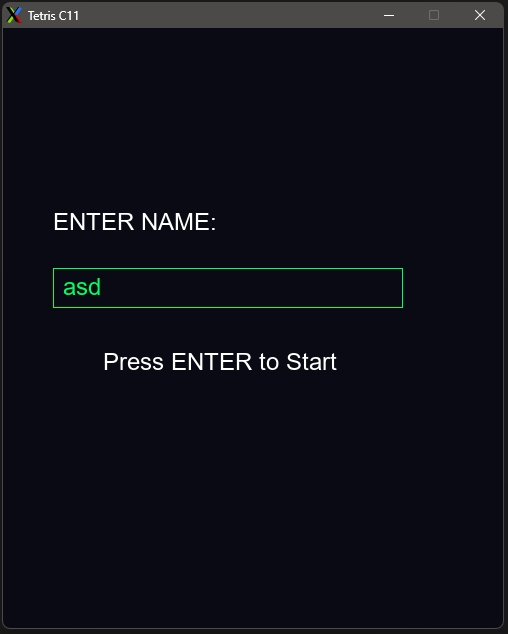
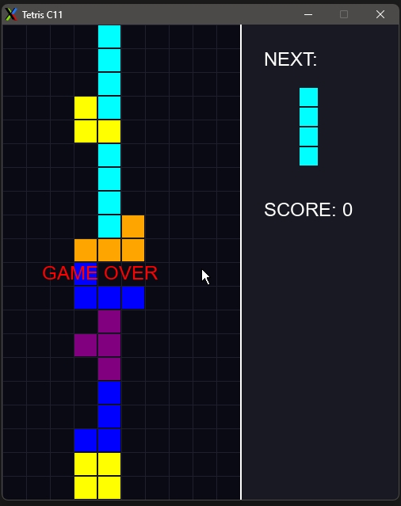
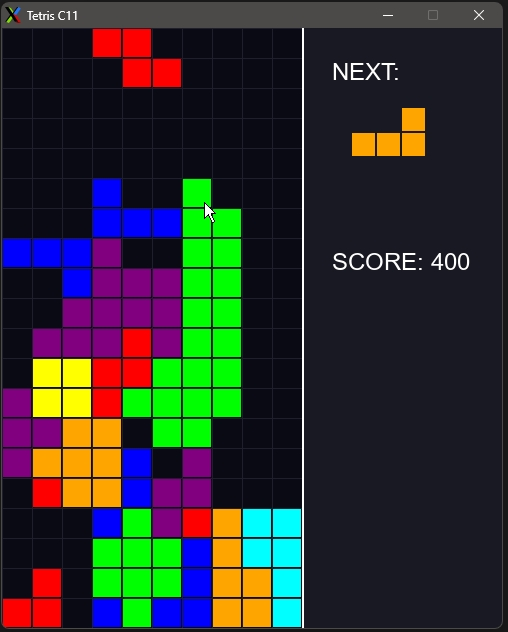

# Задание  
Написать несложную игру, на выбор:  
• тетрис  
• сапёр  
• 2048  
• крестики-нолики  
• четыре-в-ряд  
• ping-pong  
• space invaders  
• pacman  

# Сложность  
★★★★☆  

# Цель задания  
Получить опыт создания игр.  

# Критерии успеха  
1. Создано игровое приложение с главным меню и основным gameplay loop.  
2. Bonus points за графическое оформление с использованием ассетов.  
3. Bonus points за звуковое оформление.  
4. Bonus points за таблицу лидеров.  
5. Код компилируется без warning’ов с ключами компилятора -Wall -Wextra -Wpedantic -std=c11.  

---

# C11 Tetris SDL2

Классическая игра Тетрис, реализованная на языке **C11** с использованием графической библиотеки **SDL2**.  
Проект включает систему рекордов, интерактивное меню и современный интерфейс с разделением игровых зон.  

## Особенности
- **Двухзонный интерфейс**: Четкое визуальное разделение игрового «стакана» и информационной панели.
- **Предпросмотр**: Отображение следующей фигуры (Next Piece).
- **Система профилей**: Ввод имени игрока в главном меню с поддержкой текстового ввода.
- **Таблица лидеров**: Автоматическое сохранение результатов в файл `scores.txt`.
- **Графика**: Цветовая кодировка фигур (классическая палитра) и фоновая сетка для точного позиционирования.

## Управление
- **Клавиатура (Меню)**:
  - `Буквы`: Ввод имени.
  - `Backspace`: Удаление символа.
  - `Enter`: Запуск игры.
- **Клавиатура (Игра)**:
  - `Стрелка Вверх`: Поворот фигуры на 90°.
  - `Стрелки Влево / Вправо`: Перемещение.
  - `Стрелка Вниз`: Ускоренное падение.

## Требования к системе
Для компиляции необходимы библиотеки **SDL2** и **SDL2_ttf**.

### Установка зависимостей:  
**Ubuntu/Debian**:  
```sh
sudo apt install libsdl2-dev libsdl2-ttf-dev -y
```

> **Важно**: Для работы программы в корневой папке должен находиться файл шрифта **`font.ttf`**.  

## Сборка и запуск  
1. Скомпилировать проект:  
```bash
make
```

2. Запустить игру:  
```sh
make run
```

3. Очистить временные файлы:  
```sh
make clean
```

## Файлы проекта
* tetris.c — Исходный код (стандарт C11).  
* Makefile — Сценарий сборки.  
* font.ttf — Файл шрифта (пользовательский ассет).  
* scores.txt — База данных рекордов (генерируется при первом проигрыше).  

## Результат  

```sh
$ cat scores.txt
qwe 2000
bn 100
asd 2800
```






