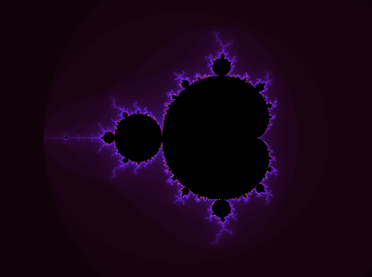
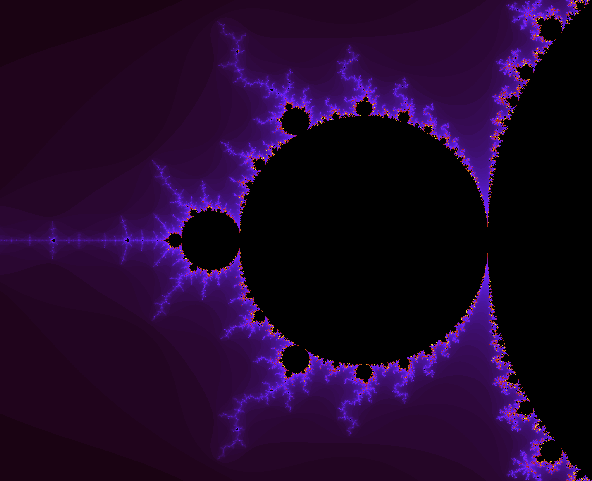
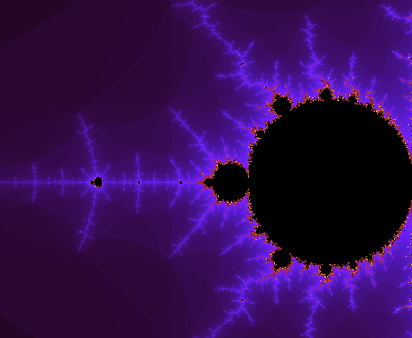
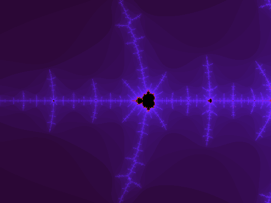
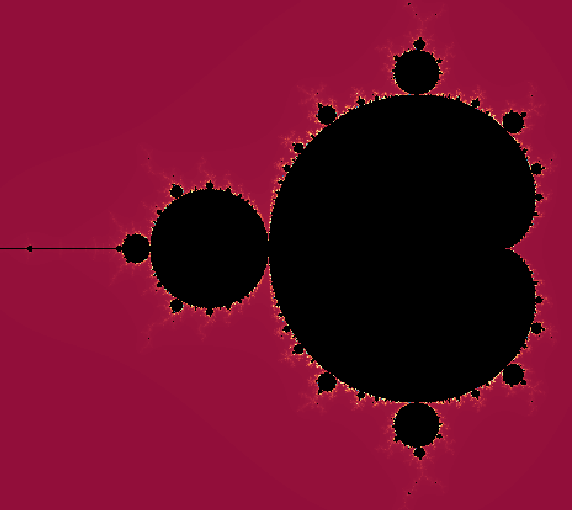

# [Создание приложения на языке С для изучения множества Мандельброта](https://codingchallenges.fyi/challenges/challenge-mandelbrot/)

## Содержание  

- [Описание](#описание)
- [Задача](#задача-—-создат-исследовательский-проект-Mandelbrot-Explorer)
  - [Нулевой шаг](#нулевой-шаг)
  - [Шаг 1](#шаг-1)
  - [Шаг 2](#шаг-2)
  - [Шаг 3](#шаг-3)
  - [Шаг 4](#шаг-4)
  - [Шаг 5](#шаг-5)
  - [Идем дальше](#идем-дальше)
- [Сборка проекта и работа с программами](#сборка-проекта-и-работа-с-программами)
- [Как использовать](#как-использовать)
  - [1. mandelbrot_base.c](#1.-mandelbrot_base.c)
  - [2. mandelbrot_bw.c](#2.-mandelbrot_bw.c)
  - [3. mandelbrot_color.c](#3.-mandelbrot_color.c)
  - [4. mandelbrot_smooth.c](#4.-mandelbrot_smooth.c)
  - [5. mandelbrot_anim.c](#5.-mandelbrot_anim.c)
    - [Рекомендуемые параметры для красивых мест](#рекомендуемые-параметры-для-красивых-мест)
    - [Как сделать видео](#как-сделать-видео)
  - [6. mandelbrot_sdl.c](#6.-mandelbrot_sdl.c)
  - [7. mandelbrot_sdl_mouse.c](#7.-mandelbrot_sdl_mouse.c)
  - [8. mandelbrot_budda.c](8.-mandelbrot_budda.c)


## Описание  

Задача состоит в том, чтобы создать собственное приложение для изучения множества  
Мандельброта.  
Множество Мандельброта — это совокупность фракталов, которые демонстрируют  
невероятную сложность при относительно простом определении. Этим термином также  
называют один конкретный пример такого множества, который при отображении даёт  
хорошо известное изображение:  



Интересен тот факт, что при увеличении масштаба набора один и тот же узор повторяется, то  
есть является рекурсивным. Например, если я увеличу масштаб в левой части, то увижу:  



Увеличим масштаб еще больше, и мы увидим повторяющийся узор:  



Чем больше мы увеличиваем масштаб, тем больше повторяющегося узора видим.  



## Задача — создать исследовательский проект Mandelbrot Explorer  

В этом задании по программированию вам нужно создать инструмент для изучения  
множества Мандельброта. То есть ваш инструмент позволит пользователю нарисовать   
первое изображение выше, а затем увеличить его, чтобы рассмотреть сходства.  

### Нулевой шаг 
На этом этапе вам нужно создать новый проект, в котором вы будете работать над  
исследованием фрактала Мандельброта. Сейчас самое время создать репозиторий  
Github/Gitlab для проекта, а когда закончите, добавьте свое общее решение в  
[список общих решений Coding Challenges!](https://github.com/CodingChallengesFYI/SharedSolutions)

### Шаг 1 
На этом этапе ваша цель — нарисовать множество Мандельброта. Для этого постройте  
график множества комплексных чисел c, для которых функция $z_{n+1} = z_n^2 + c$ не стремится к  
бесконечности при итерациях, начинающихся с нуля. Подробнее об этом можно прочитать  
на странице Википедии, посвященной [множеству Мандельброта](https://en.wikipedia.org/wiki/Mandelbrot_set).

Или, если вы предпочитаете разбираться в математике самостоятельно, на wikiHow есть  
статья о том, [как построить множество Мандельброта вручную](https://www.wikihow.com/Plot-the-Mandelbrot-Set-By-Hand). 
 
### Шаг 2  
На этом этапе ваша цель — нарисовать увеличенное изображение множества. Поэтому  
вместо того, чтобы строить график в диапазоне от -2,0 до 2,0 по каждой оси, вы можете  
построить его в диапазоне от -1,75 до 1,75 или от -1,75 до -1,5.  

### Шаг 3  
На этом этапе ваша задача — дать пользователю возможность выбрать, какую часть графика  
он хочет изучить. Либо предложите ему выделить на графике ограничивающую рамку, а  
затем используйте ее для повторного построения изображения с увеличенным масштабом,  
либо предложите ему выбрать центр и степень увеличения, а затем масштабируйте  
изображение соответствующим образом.  

### Шаг 4  
На этом этапе ваша задача — дать пользователю возможность настроить цвета,  
используемые для отображения набора. Как видите, это существенно меняет ситуацию.  



### Шаг 5  
На этом этапе вам нужно экспортировать изображение в формате PNG. На этом этапе  
пользователь может указать размер создаваемого изображения и разрешение в точках на  
дюйм. Это позволит ему создать изображение с разрешением 72 точки на дюйм для  
использования на веб-странице (например) или с разрешением 300 точек на дюйм (или  
выше), если он хочет сделать из него постер.  

### Идем дальше 
Чтобы узнать больше, изучите другие фракталы и поиграйте с ними.

## Внимание!!!  
#### Весь проект создан для расчётов на центральном процессоре.
#### В силу того, что не все процессоры (особенно старые или бюджетные) поддерживают инструкции
#### AVX (Advanced Vector Extensions), то оптимизация с использованием этих инструкций в коде не применялась.
#### При компиляции используется только опции -march=native -O3 для определения максимального ускорения расчётов процессором.
#### Никаких расчётов на FPU или процессоре видеокарты не производится.


## Сборка проекта и работа с программами  

Сборка возможна двумя программами: **make** и **Cmake**.  
Собранные исполняемые файлы выкладываются в каталог **dist/bin/**,  а объектные файлы - в **obj/**.  
Оба каталога появляются после сборки в корне проекта.  
Описание сборок и запуска отдельных программ и дополнительных библиотек "руками" находится в разделе **Как использовать**  

### Структура проекта  

Проект состоит из следующих каталогов:  

Pictures  - содержит изображения для README  
include   - содержит заголовочные файлы  
src       - содержит исходники  

и файлов:  

Makefile        - цели для сборки через __make__  
README.md       - текущий файл помощи  
build_cmake.sh  - скрипт для сборки через __Cmake__  
CMakeLists.txt  - цели для сборки через __Cmake__  

### Для сборки через __make__ всех программ сразу необходимо запустить:  

```sh
$ make
```

В начале сборки проверяются зависимости на наличие библиотек и если таковые отсутствуют,  
они устанавливаются и __make__ перезапускается автоматически.   
Сборка раскладывает все программы по своим каталогам (см. выше).   
Возможна сборка программ по отдельности. Для этого необходимо после __make__ набрать имя программы, например:  

```sh
$ make mandelbrot_color
```

При этом, после сборки программа запустится автоматически с параметрами (если таковые есть) по умолчанию.  
Например:  

```sh
$ make mandelbrot_color
[RUN]  Запуск dist/bin/mandelbrot_color с аргументами: 2...
Степень уравнения Мандельброта: 2
Цветное изображение создано!
```

Если хотите запустить программу с другими параметрами, то делать это возможно двумя способами:  
1) руками из каталога с исполняемыми файлами (см. выше) и необходимыми параметрами.  
2) через __make__ с переопределением параметров:  

```sh
$ make mandelbrot_color ARGS=3
```

Если параметров несколько, то вводить их надо через пробел и в кавычках, например:  

```sh
$ make mandelbrot_smooth ARGS="3.5 0.1 0.0 2.1 3.2"
```

### Для сборки через __Cmake__ необходимо запустить скрипт __build_cmake.sh__:  

```sh
$ ./build_cmake.sh
```

или выполнить в командной строке "руками" следующие команды:  

```sh
$ rm -rf build/ dist/
$ mkdir build && cd build
$ cmake .. -DCMAKE_INSTALL_PREFIX=../dist
$ make
```

Произойдет проверка на наличие необходимых библиотек и автоматическая установка их, если они отсутствуют, и сборка всех программ сразу.  
Возможность собирать только отдельные программы через __Cmake__, как это сделано через __make__-сборке, не предусмотрена.  
Дополнительный запуск __make install__ не требуется.  
Исполняемые файлы выкладываются в каталог dist/bin/. В каталоге  build находятся вспомагательные файлы сборки.  

### Для очистки сборок, собранных как make, так и Cmake, необходимо выполнить команду:  

```sh
$ make clean
```

Удаляются каталоги dist/bin/, obj и build, если сборка производилась __Cmake__.  
### Внимание!!!  
#### При очистке НЕ удаляется каталоги, созданные во время работы: Images, frames,  
#### в которых сохраняются изображения фрактала программами mandelbrot_sdl_mouse и mandelbrot_anim.  


## Как использовать  

### В данном разделе рассказывается, как собирать программы отдельно,  
### "руками", без использования программ для сборки __make__ или __Cmake_,  
### а также подробно разобраны все параметры, с которыми запускаются программы.  

### 1. mandelbrot_base.c  

Базовый расчёт множества Мандельброта для степени 2, выводящий изображение в консоль.  

```sh
$ gcc -O3 mandelbrot_base.c -o mandelbrot_base -Wall -Wextra -Wpedantic
```

### 2. mandelbrot_wb.c  

Базовый расчёт множества Мандельброта, создающий в текущем каталоге файл mandelbrot.ppm в черно-белом изображении.  

```sh
$ gcc -O3 mandelbrot_wb.c -o mandelbrot_wb -Wall -Wextra -Wpedantic
```

### 3. mandelbrot_color.c  

Тоже, что и предыдущий (mandelbrot_color.ppm), но изображение в простой цветовой палитре (видны переходы между оттенками)  

```sh
$ gcc -O3 mandelbrot_color.c -o mandelbrot_color -Wall -Wextra -Wpedantic
```

Запуск программы без параметров покажет способ запуска программы и описания параметров:  

```sh
$ ./mandelbrot_color
usage: ./mandelbrot_color degree

degree - Степень уравнения Мандельброта: 2 или 3

Например:
./mandelbrot_color 3
```

### 4. mandelbrot_smooth.c  

Тоже, что и предыдущий (файл mandelbrot_degree_%g.ppm), но цветовая палитра  
сглажена (логарифмический алгоритм сглаживания - используется математическая библиотека)  

```sh
$ gcc -O3 mandelbrot_smooth.c -o mandelbrot_smooth -Wall -Wextra -Wpedantic -lm
```

Запуск программы без параметров покажет способ запуска программы и описания параметров:  

```sh
$ ./mandelbrot_smooth
usage: ./mandelbrot_smooth degree frequency phase_r phase_g phase_b

degree    - Степень уравнения Мандельброта: 2 или 3
frequency - Частота. Определяет, как быстро меняется цвет при переходе от одной итерации к другой
            Низкая частота (например, 0.1): Цвет меняется медленно. Переходы будут широкими, плавными, "растянутыми".
            Высокая частота (например, 1.0 или 2.0): Цвет меняется очень быстро.
            Фрактал покроется множеством узких контрастных колец (эффект "зебры")
phase_r   - Фазовый сдвиг красного. Определяет баланс цветов
phase_g   - Фазовый сдвиг зелёного. Определяет баланс цветов
phase_b   - Фазовый сдвиг синего. Определяет баланс цветов

Например:
./mandelbrot_smooth 3 0.1 0.0 2.1 4.2
```

Пример запуска программы:  

```sh
$ ./mandelbrot_smooth 4.5 1.1 0.9 1.1 2.2
```

### 5. mandelbrot_anim.c  

Превращаем статичную картинку в анимацию, постепенно уменьшая значение zoom.  
На выходе получается каталог __frames__ с множеством PPM и PNG файлов, которы затем можно преобразовать в видео (см. ниже).  
Если каталог __frames__ уже существует, то программа выдаст предупреждение и завершится.  
Этот каталог надо удалить "руками" и перезапустить программу.  

```sh
$ gcc -O3 mandelbrot_anim.c -o mandelbrot_anim -Wall -Wextra -Wpedantic -lm
```

Запуск программы без параметров покажет список параметров и их описания:  

```sh
$ ./mandelbrot_anim

usage: ./mandelbrot_anim frame_number zoom zoom_factor frequency centerX centerY frequency phase_r phase_g phase_b

frame_number - Количество кадров для видео
zoom         - Начальный масштаб, например, 2.5
zoom_factor  - Коэффициент приближения (0.9 на 10% каждый кадр)
centerX      - Координата по оси X, по которой центрируется изображение
centerY      - Координата по оси Y, по которой центрируется изображение
frequency    - Частота. Определяет, как быстро меняется цвет при переходе от одной итерации к другой
              Низкая частота (например, 0.1): Цвет меняется медленно. Переходы будут широкими, плавными, "растянутыми".
              Высокая частота (например, 1.0 или 2.0): Цвет меняется очень быстро.
              Фрактал покроется множеством узких контрастных колец (эффект "зебры")
phase_r      - Фазовый сдвиг красного. Определяет баланс цветов
phase_g      - Фазовый сдвиг зелёного. Определяет баланс цветов
phase_b      - Фазовый сдвиг синего. Определяет баланс цветов

Например:
./mandelbrot_anim 1000 2.5 0.99 0.1 -1.768778833 -0.001738974 0.0 2.1 4.2
```

Пример запуска программы:  

```sh
$ ./mandelbrot_anim 2.5 1000 0.1 0.99 -0.088 0.654 0.3 0.0 2.1 4.2
```

#### Рекомендуемые параметры для красивых мест  

Вы можете менять значения centerX, centerY и zoom, чтобы исследовать другие области:  

// Координаты цели (Долина Морских Коньков)    
centerX = -0.743643887037158; // -0.743643887037158704752191506114774  
centerY = 0.131825904205312;  // 0.131825904205311970493132056385139  

«Слоновья долина»:  
centerX = 0.3;  
centerY = 0.01;  
zoom = 0.1;  

Тройная спираль:  
centerX = -0.088;  
centerY = 0.654;  
zoom = 0.01;  

Глубокое погружение (мини-Мандельброт):  
centerX = -1.768778833;  
centerY = -0.001738974;  
zoom = 0.0001;  

Узнать самостоятельно координаты красивых мест в множестве Мандельброта для любых степеней можно, запустив  
программу mandelbrot_sdl_mouse. Координаты выбранных точек и зум видны в заголовке экрана, а также  
выводятся в консоль при сохранении изображения в файл.  

#### Как создать GIF файл из множества файлов ppm  

Создать GIF-анимацию из последовательности PPM-файлов или PNG-файлов проще всего с помощью  
инструментов командной строки ImageMagick или FFmpeg.  

**Способ 1:** С помощью ImageMagick (самый простой)  
Утилита convert из пакета ImageMagick автоматически объединяет изображения в анимацию.  

1. Установите ImageMagick, если он еще не установлен:  

```sh
$ sudo apt update
$ sudo apt install imagemagick
```

2. Выполните команду в папке с вашими PNG-файлами:  

```sh
$ time convert -delay 20 -loop 0 frames/*.png mandelbrot.gif
```

-delay 20: устанавливает задержку между кадрами (в сотых долях секунды; 20 = 0.2 сек или 5 кадров в секунду).  
-loop 0: делает GIF бесконечно зацикленным.  
*.png: выбирает все файлы с расширением .png в алфавитном порядке.  

#### Внимание!!!  
#### При недостаточном количестве памяти может возникать ошибка:  
```sh
$ time convert -delay 20 -loop 0 frames/*.png mandelbrot.gif
convert-im6.q16: cache resources exhausted `frames/mandelbrot_00628.png' @ error/cache.c/OpenPixelCache/4119.
```
#### В этом случае есть 2 варианта устранения проблемы:
1.  Временно поднять порог ресурсов прямо в строке запуска с помощью флага -limit  
```sh
$ time convert -limit memory 2GiB -limit map 4GiB -delay 20 -loop 0 frames/*.png mandelbrot.gif
```
2. Исправить это глобально, отредактировав файл /etc/ImageMagick-6/policy.xml, увеличив значения в строках: 
```xml
<policy domain="resource" name="memory" value="2GiB"/>
<policy domain="resource" name="disk" value="8GiB"/>
```

Запуск сразу с оптимизацией:  

```sh
$ time convert -limit memory 4GiB -delay 20 frames/*.png -layers Optimize mandelbrot_optimized.gif
```

**Способ 2:** С помощью FFmpeg (высокое качество)  
FFmpeg лучше справляется с большим количеством кадров и позволяет точнее настраивать палитру для улучшения качества.  

Установите FFmpeg:  

```sh
$ sudo apt install ffmpeg
```

Выполните команду:  
Если файлы пронумерованы (например, img001.png, img002.png), используйте шаблон:  

```sh
$ ffmpeg -framerate 10 -i frames/img%05d.png output.gif
```

-framerate 10: количество кадров в секунду.  
-i img%05d.ppm: шаблон входных файлов, где %05d означает пять цифр в названии  
    (названия файлов могут быть другими, см. каталог __frames__).  


**Особенности работы в Ubuntu**  
Безопасность ImageMagick: В современных версиях Ubuntu политика безопасности может запрещать некоторые операции.   
Если команда выдает ошибку доступа, отредактируйте файл /etc/ImageMagick-6/policy.xml, изменив права для формата   
GIF с none на read|write.   
Качество: Формат GIF ограничен 256 цветами. Если при конвертации из PPM (который хранит миллионы цветов) качество   
кажется низким, рекомендуется использовать фильтр palettegen в FFmpeg для создания оптимальной палитры.  

***Для настройки скорости и уменьшения размера GIF*** в Ubuntu используйте следующие параметры для ImageMagick и FFmpeg.  

**1. Настройка скорости анимации**
Скорость в GIF определяется задержкой между кадрами (delay) или количеством кадров в секунду (FPS).  
ImageMagick (convert): Использует единицы в 1/100 секунды.  
Замедлить: Увеличьте число в -delay. Например, -delay 50 (0.5 сек на кадр).  
Ускорить: Уменьшите число. Например, -delay 5 (0.05 сек на кадр).  
Команда: convert -delay 10 -loop 0 *.ppm result.gif  
FFmpeg: Использует параметр -framerate для входных файлов.  
Стандарт: 10–15 FPS обычно достаточно для плавности при разумном размере.  
Команда: ffmpeg -framerate 15 -i img%03d.ppm output.gif  

**2. Оптимизация размера файла**  
GIF-файлы часто получаются громоздкими. Вот основные способы их «сжать»:  

**С помощью ImageMagick**  
Слои оптимизации (-layers Optimize): Самый эффективный встроенный метод.  
Он сохраняет только изменившиеся части пикселей между кадрами.  

```sh
$ convert result.gif -layers Optimize optimized.gif
```

Уменьшение количества цветов: Ограничение палитры (например, до 64 или 128 цветов) существенно снижает вес.  

```sh
$ convert result.gif -colors 64 optimized.gif
```

Размытие похожих цветов (-fuzz): Объединяет близкие оттенки в один, что улучшает сжатие.  

```sh
$ convert result.gif -fuzz 5% -layers Optimize optimized.gif
```

**С помощью FFmpeg (Высокое качество + Сжатие)**  
Для лучшего соотношения качество/размер используйте двухпроходную генерацию палитры.  
Это создаст файл с точной цветопередачей, который весит меньше, чем при стандартной конвертации.  

```sh
# 1. Создаем оптимальную палитру
$ ffmpeg -i img%05d.ppm -vf "palettegen" palette.png

# 2. Применяем палитру и масштабируем (например, ширина 500px)
$ ffmpeg -i img%05d.ppm -i palette.png -filter_complex "scale=500:-1:flags=lanczos[x];[x][1:v]paletteuse" output.gif
```
time ffmpeg -framerate 50 -i frames/mandelbrot_%05d.png -vf "split[s0][s1];[s0]palettegen=max_colors=256[p];[s1][p]paletteuse=dither=sierra2_4a" mandelbrot_optimized.gif


#### Как сделать видео  

Каждому кадру даётся уникальное имя (например, frame_00000.ppm, frame_00001.ppm и т.д.), которое   
записывается в каталог frames в текущей папке.  
Для соборки видео используется утилита FFmpeg в Linux (самый простой способ собрать из картинок видео).  
В Ubuntu для установки утилиты FFmpeg запустить в командной строке:  

```sh
$ sudo apt install ffmpeg -y
```

Чтобы преобразовать полученные кадры в видео, необходимо выполнить в командной строке команду:  

```sh
$ ffmpeg -framerate 30 -i frames/mandelbrot_%05d.png -c:v libx264 -pix_fmt yuv420p output.mp4
```

В результате получим видео файл с постепенным увеличением фрактала в окне 800х800 с центром в заданной координате.  
Если видео получилось большое и на __GitHub__ оно не влазит в бесплатный контент, то можно его дополнительно сжать до нужного размера:  
```sh
$ ffmpeg -i input.mp4 -vcodec libx264 -crf 28 -preset faster -maxrate 1M -bufsize 2M output.mp4
```

где:
- crf 28: регулирует качество (чем выше число, тем меньше файл, обычно 23–28 — баланс).  
- vcodec libx264: самый совместимый формат для браузеров.  

Видео фрактала Мандельброа в одной из точек:

<video src="https://github.com/user-attachments/assets/daaddb38-dfc3-450a-8138-3028668d591f" width="100%" controls></video>


### 6. mandelbrot_sdl.c  

Интерактивный Мандельброт, управляемый стрелками для центрирования изображения и + и - для его увеличения/уменьшения.  

```sh
$ sudo apt-get install libsdl2-2.0-0 libsdl2-dev -y
$ sudo apt-get install libsdl2-image-dev libsdl2-image-2.0-0 -y
$ gcc -O3 mandelbrot_sdl.c -o mandelbrot_sdl -Wall -Wextra -Wpedantic -lSDL2 -lm -fopenmp
```

Запуск программы без параметров покажет список и описания параметров:  

```sh
$ ./mandelbrot_sdl
usage: ./mandelbrot_sdl width height
width   - Ширина окна
height  - Высота окна
```

Пример запуска программы:  

```sh
$ ./mandelbrot_sdl 1000 800
```

### 7. mandelbrot_sdl_mouse.c  

Интерактивный Мандельброт, управляемый манипулятором "мышь".  
Стрелки перемещают изображение в стороны/вверх/вниз, [+] - приближает, [-] - отдаляет.  
Левая клавиша "мыши" центрирует и приближает изображение, правая клавиша "мыши" центрирует и отдаляет изображение.  

```sh
$ gcc -O3 mandelbrot_sdl_mouse.c -o mandelbrot_sdl_mouse -Wall -Wextra -Wpedantic -lSDL2 -lm -fopenmp
```

Пример запуска программы:  

```sh
$ ./mandelbrot_sdl_mouse
```

При запуске программы она выдаст сообщение, в котором можно будет выбрать помощь и прочитать, как работает программа:  

```sh
$ ./mandelbrot_sdl_mouse

Сейчас применены параметры по умолчанию.
Для подробности нажмите h.
Хотите изменить параметры? (yY/[nN]/hH): h

=============== ПОМОЩЬ ===============
При запуске программы вы можете выбрать:
1. Прочитать данную инструкцию по запуску (нажать h или H).
2. Запустить её с параметрами по умолчанию (нажать n, N или Enter).
3. Изменить параметры по умолчанию (нажать y или Y)
(в квадратных скобках ниже указаны параметры по умолчанию).
width       - Ширина окна. [800]
height      - Высота окна. [800]
frequency   - Частота. [0.2]. Определяет, как быстро меняется цвет при переходе от одной итерации к другой.
              !!! Не должна быть равна 0.
              Низкая частота (например, 0.1): Цвет меняется медленно. Переходы будут широкими, плавными, "растянутыми".
              Высокая частота (например, 1.0 или 2.0): Цвет меняется очень быстро.
              Фрактал покроется множеством узких контрастных колец (эффект "зебры").
MAX_ITER    - Максимальное количество итераций, за которое точка выйдет за границы множества. [1000]
R           - Красный для палитры. [255.0]
G           - Зелёный для палитры. [150.0]
B           - Синий для палитры. [0.0]

Сохранение:
Для сохранения изображения необходимо нажать клавишу 's'
После чего, ввести размеры окна в пикселях и разрешение в точках на дюйм,
либо нажать на Enter, чтобы оставить значения по умолчанию.
Начальная палитра вокруг множества задаётся в RGB в вещественном виде.
Цвет палитры внутри множества не меняется и всегда чёрный.

Перемещение:
Для перемещения по изображению можно использовать клавиши: вверх/вниз/влево/вправо.
Для приближения/удаления изображения можно использовать клавиши [+] / [-]
Кроме того, клик по изображению левой клавишей 'мыши' приближает изображение,
а клик правой клавишей 'мыши' - отдаляет изображение. Изображение центрируется по нажатой точке.
======================================
```


### 8. mandelbrot_budda.c 


Программа вычисляет и выводит в PNG файл множество Мандельброта - Будда.

```sh
$ gcc -O3 mandelbrot_budda.c -o mandelbrot_budda -Wall -Wextra -Wpedantic -lSDL2 -lm -fopenmp
```

Пример запуска программы:  

```sh
$ ./mandelbrot_budda 0.9 1.2 0.3
```

При запуске программы без параметров, она выдаст сообщение, как правильно её запускать: 

```sh
Использование: ./mandelbrot_budda R G B
R   - Красный для палитры. [0.8]
G   - Зелёный для палитры. [1.2]
B   - Синий для палитры. [0.4]
Пример: ./dist/bin/mandelbrot_budda 0.8 0.7 0.5

```

  

  

 


## Используемые материалы

[Фрактальные типы](https://legalizeadulthood.github.io/iterated-dynamics/#_fractal_types)  
[WiKi с красивыми картинками и координатами красивых областей](https://ru.wikipedia.org/wiki/%D0%9C%D0%BD%D0%BE%D0%B6%D0%B5%D1%81%D1%82%D0%B2%D0%BE_%D0%9C%D0%B0%D0%BD%D0%B4%D0%B5%D0%BB%D1%8C%D0%B1%D1%80%D0%BE%D1%82%D0%B0)  
[Будда](https://en.wikipedia.org/wiki/Buddhabrot)  
[STB - библиотеки в одном файле](https://github.com/nothings/stb/tree/master)  
[Изображения множества Мандельброта](https://www.hpdz.net/StillImages/MandelbrotSet.htm)  
[Mandelbulb3D](https://github.com/thargor6/mb3d/tree/master)
[Знакомство с множествами Жюлиа и Мандельброта](https://www.karlsims.com/julia.html)
[Фракталы - это замечательно](https://github.com/letsgogeeky/fract-ol)
[фрактол](https://github.com/stepanm99/fractol)
[Алгоритмы — C](https://github.com/TheAlgorithms/C)
[Фрактальный визуализатор](https://github.com/had-it/IS1500-Mini-Project)
[mandelbrot](https://github.com/josch/mandelbrot/tree/master?tab=readme-ov-file#benchmark)
[Новая последовательность Мандельброта](https://en.wikipedia.org/wiki/File:Mandelbrot_sequence_new.gif)
[Mandelbrot and Julia sets online explorer. WebGL based](https://michurin.github.io/fast-online-mandelbrot-set-explorer/)
[Barnsley fern - Wikipedia](https://en.wikipedia.org/wiki/Barnsley_fern)
[Быстрый онлайн-просмотр множества Мандельброта](https://github.com/michurin/fast-online-mandelbrot-set-explorer)
[путешествие вокруг множества Мандельброта ](https://www.shadertoy.com/view/3dfBDN)
[Интерактивный Набор Julia](https://www.shadertoy.com/view/tsBcDc)
